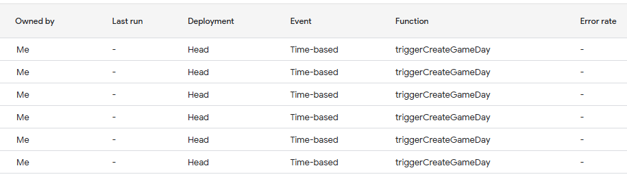

# NFL-Score-Notification
This is a personal project where I wanted to use Go and APIs to practice my skills. The point of this project was to send notifications to my phone via text message when NFL games ended. I wanted to send texts of the final scores in every game window so usually 1:00 PM, 4:05 PM, 4:25 PM, 8:15 PM, etc. I was able to find a Google sheet created by [Ryan Buckner](https://www.reddit.com/r/NFLstatheads/comments/x0usye/real_time_nfl_scores_google_sheet/) which has game data for every game of the 2024 season. I modified the existing spreadsheet to be better formatted and changed the Google Apps Script associated with the sheet. The changes I made include automatically setting up [triggers](https://developers.google.com/apps-script/guides/triggers/installable) to run functions. I created triggers to only run on game days and to delete triggers once the  last game of a game day was completed.

## Sheets
<details>
  <summary><a href="https://docs.google.com/spreadsheets/d/1YeKmJEr0zGP00ZhgRmVC4gaOet5D2f_UNsF17iOkPGI/edit?pli=1&gid=2012782522#gid=2012782522" target="_blank" rel="noopener noreferrer"> Week Filter </a> </summary>
  
  
</details>

<details>
  <summary><a href="https://docs.google.com/spreadsheets/d/1YeKmJEr0zGP00ZhgRmVC4gaOet5D2f_UNsF17iOkPGI/edit?pli=1&gid=1564337599#gid=1564337599" target="_blank" rel="noopener noreferrer"> Division Standings Sheet </a></summary>
  
</details>

<details>
  <summary><a href="https://docs.google.com/spreadsheets/d/1YeKmJEr0zGP00ZhgRmVC4gaOet5D2f_UNsF17iOkPGI/edit?pli=1&gid=1564337599#gid=1564337599" target="_blank" rel="noopener noreferrer"> AFC Standings Sheet</a></summary>
  
</details>

<details>
  <summary><a href="https://docs.google.com/spreadsheets/d/1YeKmJEr0zGP00ZhgRmVC4gaOet5D2f_UNsF17iOkPGI/edit?pli=1&gid=362441396#gid=362441396" target="_blank" rel="noopener noreferrer"> NFC Standings Sheet</a></summary>
  
</details>

<details>
  <summary><a href="https://docs.google.com/spreadsheets/d/1YeKmJEr0zGP00ZhgRmVC4gaOet5D2f_UNsF17iOkPGI/edit?pli=1&gid=1227961915#gid=1227961915" target="_blank" rel="noopener noreferrer">Live Scoring</a></summary>
  
</details>

<details>
  <summary><a href="https://docs.google.com/spreadsheets/d/1YeKmJEr0zGP00ZhgRmVC4gaOet5D2f_UNsF17iOkPGI/edit?pli=1&gid=707813147#gid=707813147" target="_blank" rel="noopener noreferrer">O/U Analysis Sheet</a></summary>
  
</details>

## Trigger functions
The main function in the Google Apps Script updates the Google spreadsheet. I have created multiple triggers to only update the spreadsheet on game days 
and to automatically create and delete triggers. There are multiple functions for deleting becasuse I wanted to have a trigger to run ~2 hours after a game start and check every 5 minutes if the game was over. I couldn't set a trigger to start at a specific time and then run every 5 minutes so multiple triggers were created. 


### triggerCreateGameDay()
**returns: Nothing**

On game days during the 2024-2025 season, there are football games being played everyday of the week besides Tuesday. There are 6 triggers to check if there is a game on Monday, Wednesday, Thursday, Friday, Saturday and Sunday (One trigger per weekday). These triggers never get deleted because they are needed to create other triggers if there is a game.


### triggerCreateMain()
**returns: Nothing**

```triggerCreateMain()``` is used in ```triggerCreateGameDay()``` when it's game day a trigger to run ```main()``` is created which updates the spreadsheet every 5 minutes. To prevent API Quotas from being exceeded the trigger starts running when the game starts and ends when the last game is over. 

```triggerCreateMain()``` creates a trigger for deleting triggers as well  using ```triggerLastGame()``` .

### triggerLastGame()
**returns: Last game ID if main trigger exists**

This function creates another trigger using the ```triggerDeleteMain()``` to create a trigger that uses ```triggerDeleteTriggers()```  2 hours 14 minutes after a game starts to check if the last game is over.

### triggerDeletemain()
**returns: Nothing**

This function creates another trigger that uses ```triggerDeleteTriggers()``` to run every 5 minutes.

###  triggerDeleteTriggers()
**returns: Nothing**

This is the function that actually deletes all triggers except ```triggerCreateGameDay``` when the game status is "game over".

## Helper functions for triggers
### triggerCheckGameDays()
**returns: Nothing**

Creates a trigger for ```triggerCreateGameDay()``` for each week day there is a NFL game automatically to save time if these were accidentally deleted.

### triggerDeleteAll()
**returns: Nothing**

Deletes all active triggers saving time instead of going one by one.

### triggerActive() 
**Returns: An array of objects for information about active triggers**

Instead of using an array and looping through  ```ScriptApp.getProjectTriggers()``` each time I decided to store information in an array of objects for each trigger. The trigger ID is needed to delete triggers and since ```triggerCreateGameDay()``` exists 6 times there are 6 different IDs so they get put into an array. 

```alltriggerActive['triggerCreateGameDay']```


## Credentials
For my set up I used 
- Mongodb to store the data from the spreadsheet
- Google service account to authenticate and gave the service account access to the Google sheet with NFL game information so that I could make API calls using [Google Sheets API](https://developers.google.com/sheets/api/guides/concepts) with Go
